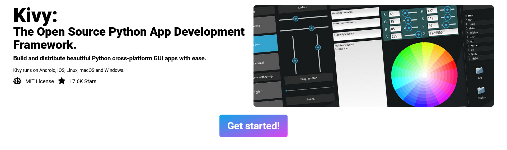
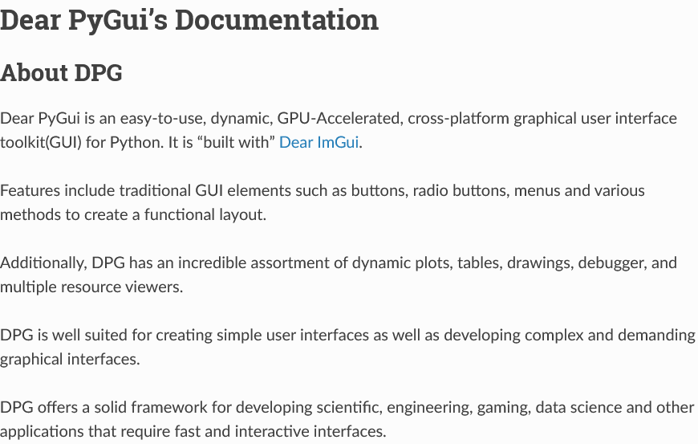
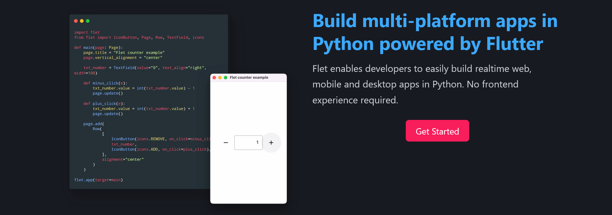

### Kivy https://kivy.org/

The Open Source Python App Development Framework.

### Dear PyGui https://dearpygui.readthedocs.io/en/latest/

Dear PyGui is an easy-to-use, dynamic, GPU-Accelerated, cross-platform graphical user interface toolkit(GUI) for Python.

https://github.com/hoffstadt/DearPyGui

### Flet https://flet.dev/

Build multi-platform apps in Python powered by Flutter

